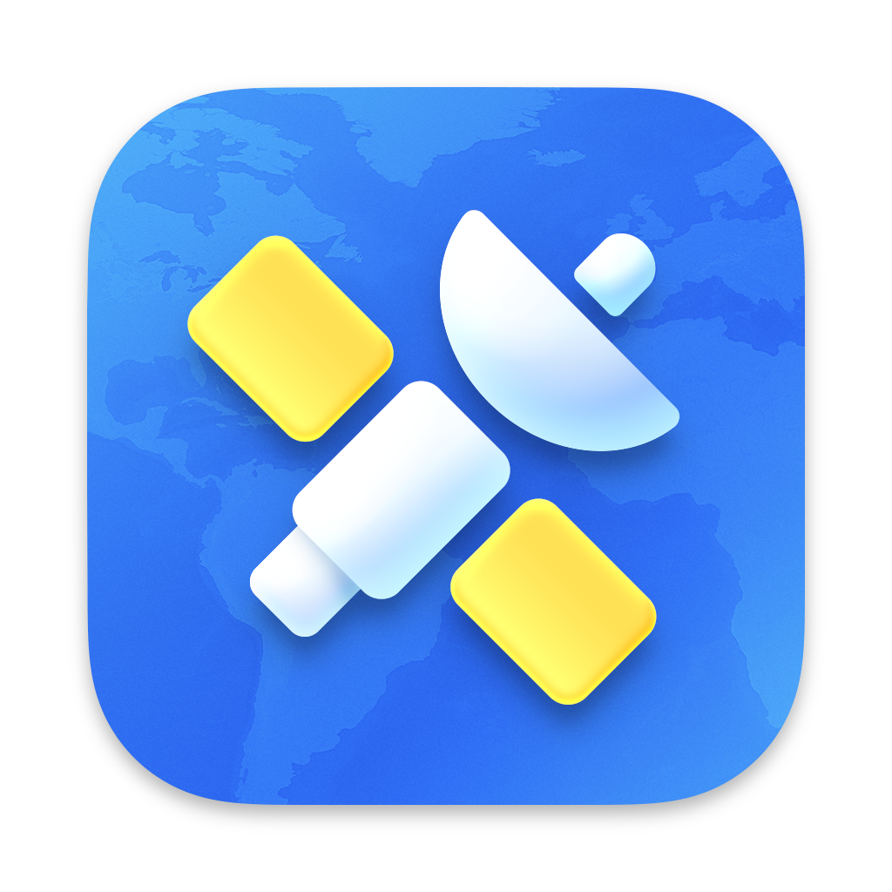

<div align="center">



# DashNews

[](LICENSE)
[](#)
[](#)
[](https://github.com/alzimerahmed/DashNews/actions/workflows/ci.yml)

*A free and open-source feed reader for macOS and iOS.*

[Features](#features) • [Building](#building) • [Usage](#usage) • [License](#license)

</div>

---

## Features

- **Feed formats**: RSS, Atom, JSON Feed, and RSS-in-JSON.
- **Local-first**: articles are stored on device in a SQLite database. No account required.
- **Optional sync**: CloudKit, NewsBlur, Feedbin, and any Google-Reader-compatible API.
- **Native on both platforms**: SwiftUI/AppKit, sidebar tree navigation, smart feeds (Today, Unread, Starred).
- **Article extraction**: read the full text of an article page without leaving the app.
- **Themes**: article appearance packages (`.nnwtheme`), including Hyperlegible.
- **Keyboard-first on Mac**: full menu commands and AppleScript support.
- **Private**: no analytics, no tracking, no ads.

DashNews is a fork of [NetNewsWire](https://github.com/Ranchero-Software/NetNewsWire) by Brent Simmons and contributors, rebranded and continued by Alzimer Ahmed.

## Building

Requires a Mac with Xcode 26.3.

```bash
git clone https://github.com/alzimerahmed/DashNews.git
cd DashNews
./setup.sh          # creates local code-signing settings
```

Then open `NetNewsWire.xcodeproj` and build the `NetNewsWire` (macOS) or `NetNewsWire-iOS` scheme. You can build and test without a paid developer account.

All builds and tests run in CI on every push and pull request (SwiftLint strict, macOS and iOS test plans).

## Usage

Add a feed with **File → New Feed** (⌘N), paste a feed or site URL. Choose **On Disk** to keep everything local, or sign into a sync account in **Settings → Accounts**.

## FAQ / Troubleshooting

**Why does the project still say "NetNewsWire" in Xcode?**
The build-system rename (project, targets, bundle IDs) is a planned, CI-verified change — see the roadmap. The app identity, license, and ownership are already DashNews.

**Can I use my existing NetNewsWire feeds?**
Yes — export an OPML file from any reader and import it in DashNews.

## Contributing

Fork the repository, create a branch, and open a pull request. Keep changes focused; CI must pass (SwiftLint strict, macOS and iOS tests).

## Roadmap

- [ ] Build-identity rebrand (project/targets/bundle IDs → DashNews)
- [ ] Full-text article search (SQLite FTS5) and saved searches
- [ ] Local keyword rules (hide/highlight per feed)
- [ ] Read-later service integration
- [ ] iCloud position sync for local accounts
- [ ] On-device article summarization and per-feed highlighting

## Changelog

See [Releases](https://github.com/alzimerahmed/DashNews/releases).

## License

Copyright © 2026 Alzimer Ahmed.

DashNews is free software under the [MIT License](LICENSE). It includes code from NetNewsWire, © 2002–2025 Brent Simmons and contributors, under the same license.
